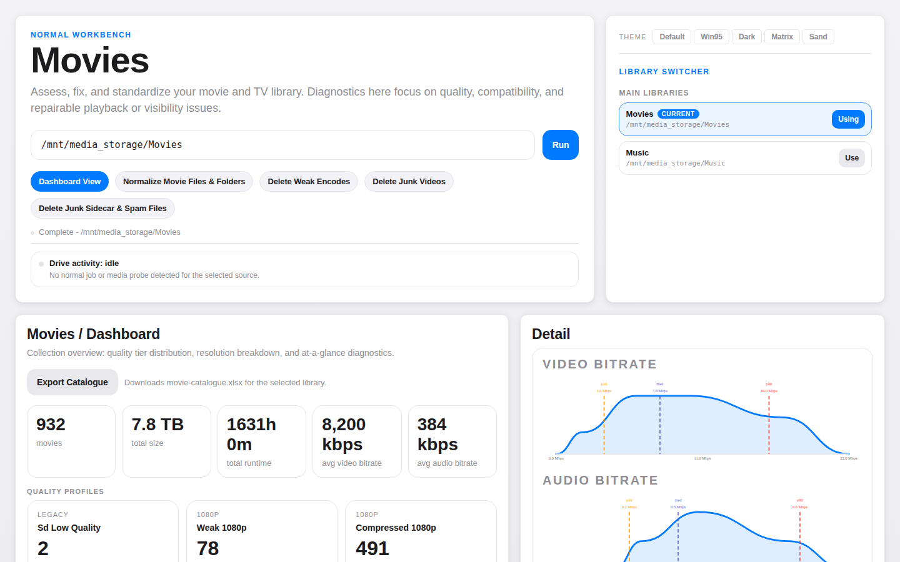
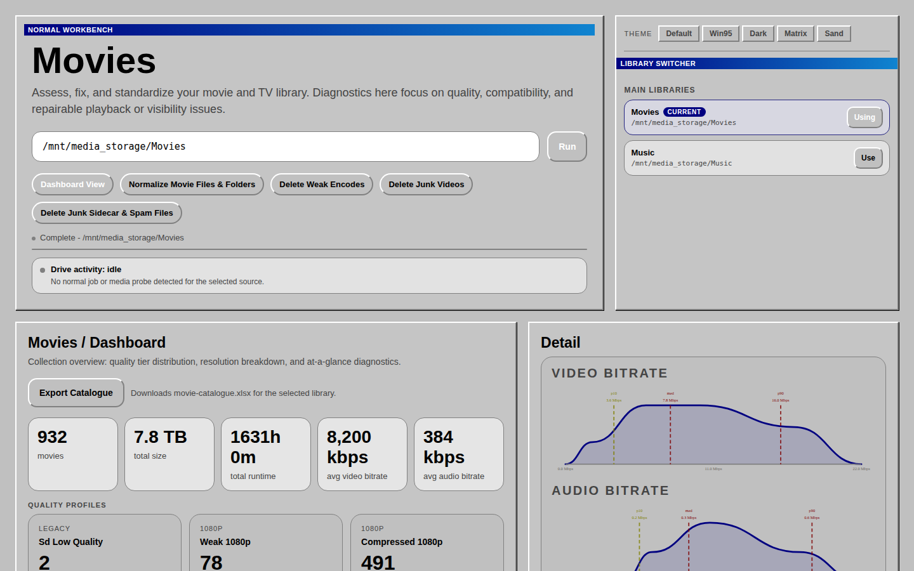
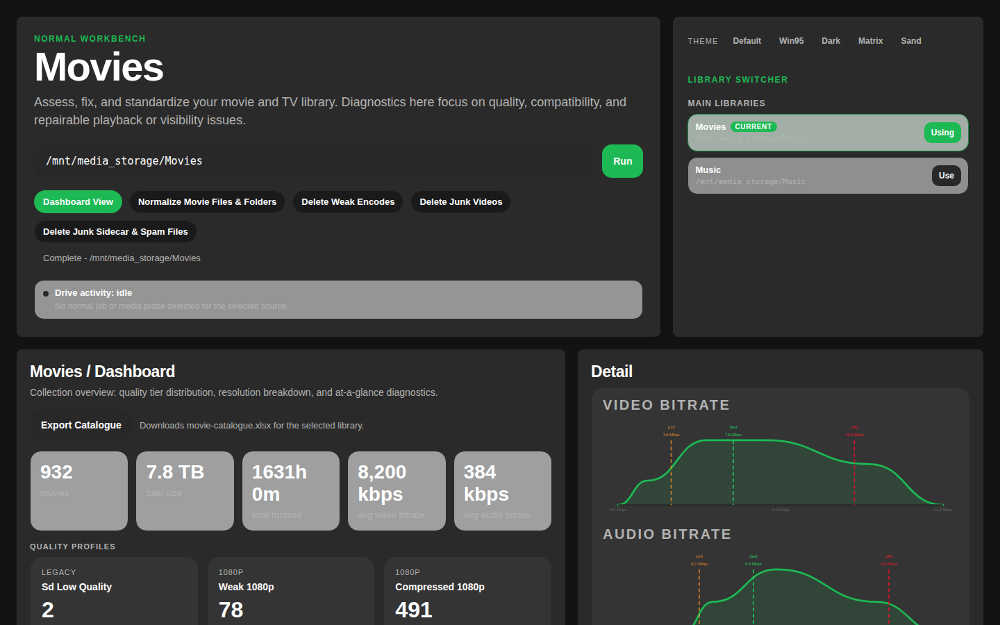
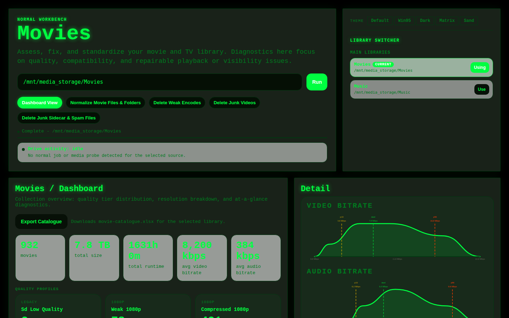
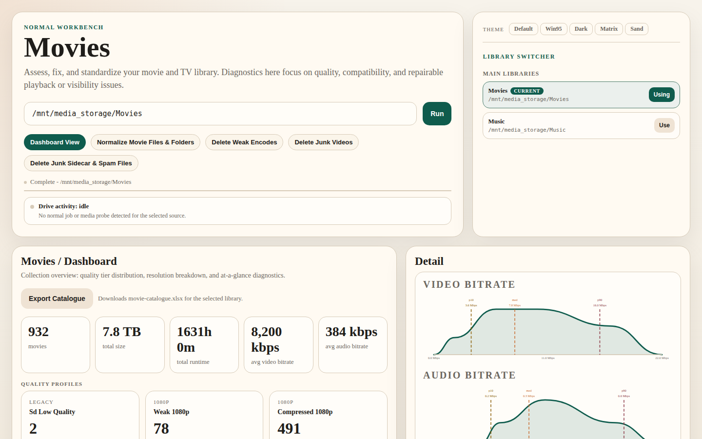

# Movies

The movie lane handles three practical problems in a pirated library: inconsistent naming, uneven encode quality, and bad multi-audio packaging.



## Dashboard

A library-wide view of encode quality — resolution breakdown, quality tier distribution, and bitrate histograms. A good first stop to understand the shape of your collection before deciding what to clean up.

Theme examples:









## Canonical Lists

The **Canonical Lists** page compares owned titles against live all-time movie lists using TMDb and a local cache. It is title-coverage focused: bitrate, quality tiers, and warning telemetry do not affect the result.

Pass `--tmdb-key` to `normal web` or set `TMDB_KEY` before launch. Current badges are intentionally simple and good enough for first-pass coverage tracking; badge-system refinement is deferred.

## Normalize names

Files named by whoever uploaded them tend to have inconsistent formatting — varying year placement, leftover technical tokens, mismatched folder names. `normal` parses each path locally (no network lookups) and proposes a clean, consistent target shape:

```
Title (Year) [technical tokens]/Title (Year) [technical tokens].mkv
```

Ambiguous parses are flagged as `review`. Everything else is `safe`. You review the plan before anything moves.

The Normalize review table now stays tighter: `Confidence`, `Type`, `Path`, `Current`, and `Proposed` are shown, while the old `Reason` column is no longer rendered in the web UI.

## Quality triage

A full quality scan profiles every file against a bitrate/resolution ladder:

| Tier | What it means |
|---|---|
| `4k_remux` / `4k_uhd` | Reference quality |
| `compressed_4k` | Acceptable 4K |
| `1080p_uhd` / `compressed_1080p` | Good 1080p |
| `minimum_acceptable_1080p` | Watchable |
| `weak_1080p` / `weak_4k` / `sd_low_quality` | Candidates for replacement |

Quality scan results now also show a main-audio summary for the playback-relevant stream, separate from audio bitrate. The intent is fast library triage: you can see `AAC 2.0` versus `Dolby Digital 5.1`, `Dolby Digital Plus 5.1 Atmos`, `Dolby TrueHD 7.1 Atmos`, or `DTS-HD MA 5.1` at a glance without opening per-stream details.

The **Delete Weak Encodes** page lets you select weak files for deletion. Each deleted file goes into a replacement queue — when a better encode for the same title shows up in a future scan, it's automatically marked complete.

Queue history has four hard filters: `Deleted, Awaiting Replacement`, `Replaced`, `Deleted From Queue`, and `All Items`. Deleted rows can be dismissed from queue history inline when the release is no longer worth replacing. That action only changes queue state; it does not touch media files.

The queue-history table is sortable by title, year, and IMDb rating. IMDb ratings are fetched from [OMDb](https://www.omdbapi.com/) and require a free API key passed via `--omdb-key` or the `OMDB_KEY` environment variable. Without a key the column is hidden.

For the same source path, movie replacement-queue state is cached locally as well as persisted on disk, so `Deleted, Awaiting Replacement` history survives a hard refresh without needing a fresh scan first.

## Multi-audio packaging triage

Some MKVs are muxed with the wrong main audio track: for example, Italian marked as default and a weaker English track left as the fallback. The **Fix Multi-Audio Packaging** page uses the same replacement-queue workflow as weak encode triage, but with different scan rules:

- detect non-English default audio when English is present
- flag the stronger case where the English fallback is materially weaker than the default track
- show the main audio summary plus default-vs-English stream summaries so the queue is explainable before deletion

For MKVs, the page can now do an in-place lossless repair that flips the default audio flag to the best English track. It also supports a stricter variant that drops audio streams explicitly tagged as non-English while keeping English and untagged audio. Unsupported containers are left as review-only items. Replacement queue delete/replace is still available for genuinely bad releases.

While a remux is running, the page locks checkbox selection and disables conflicting bulk actions. This prevents mixing a live mux batch with a later delete click on a different selection set. The destructive `Delete Selected Files` button is also separated to the far right of the action row so it is visually distinct from the two repair actions.

Current safety note: `Make English Default` has been exercised against real files. `Make English Default + Delete Foreign Audio` is implemented, but it is currently untested on real libraries and should still be treated as a cautious review-only workflow before first public push.

## Junk cleanup

Two pages handle library noise:

- **Delete Junk Videos** — samples, featurettes, and shorts, detected by path tokens and duration
- **Delete Junk Sidecar & Spam Files** — promo PDFs, NFO files, and other non-video sidecars

Both show a preview list before anything is deleted.

Operational note: the heavy movie-side web scans that feed these workflows no longer pre-enumerate the whole tree before processing. They traverse incrementally with cancellation checks, and that execution-model change was the main fix for the earlier CPU spike on large libraries and risky mounts.

## Catalogue export

Export a formatted XLSX of your full library: title, year, resolution, video codec, audio, container, file size — sorted alphabetically.

```bash
normal movie-register --report scan.json --xlsx catalogue.xlsx
```

The `Audio` column uses the same normalized main-audio summary as the scan and web UI.

## Web UI pages

| Page | What it does |
|---|---|
| Dashboard | Quality overview — tiers, histograms, resolution breakdown |
| Normalize | Review and apply rename plans |
| Delete Weak Encodes | Triage and queue replacements |
| Fix Multi-Audio Packaging | Detect wrong-language defaults, remux MKVs to prefer English, optionally drop tagged foreign-language audio, or queue replacements |
| Delete Junk Videos | Remove samples and featurettes |
| Delete Junk Sidecar & Spam Files | Remove sidecar and spam files |
| Canonical Lists | Compare owned titles against live all-time movie lists and unlock simple coverage badges |

## Known issue

There is an open issue around movie probes not always unwinding cleanly when a scan is cancelled and another UI action starts immediately after. Exact reproduction conditions are still unknown. In some cases a background `ffprobe` keeps running and is not visible through the current Drive Activity `ps` check.

Low priority parsing edge case: some low-quality multi-movie pack names can leak genre-style tokens such as `Sci Fi` into the parsed title when those tokens appear before the year. Current guidance is to treat those as local repair cases rather than broaden the parser heuristics.
