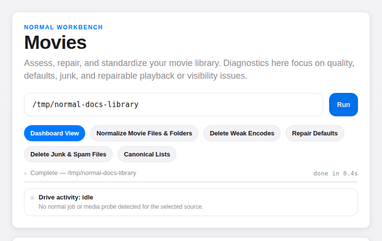
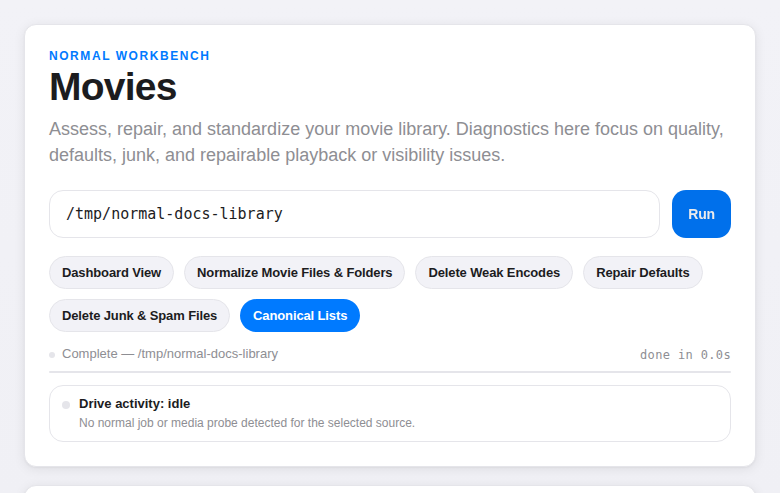
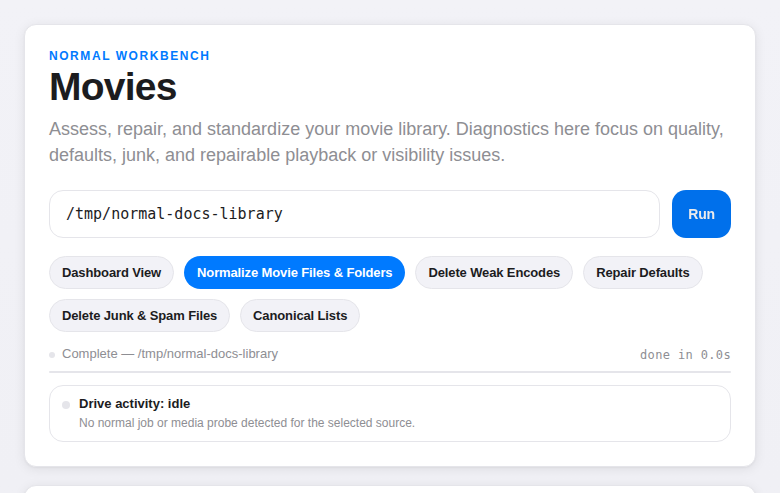
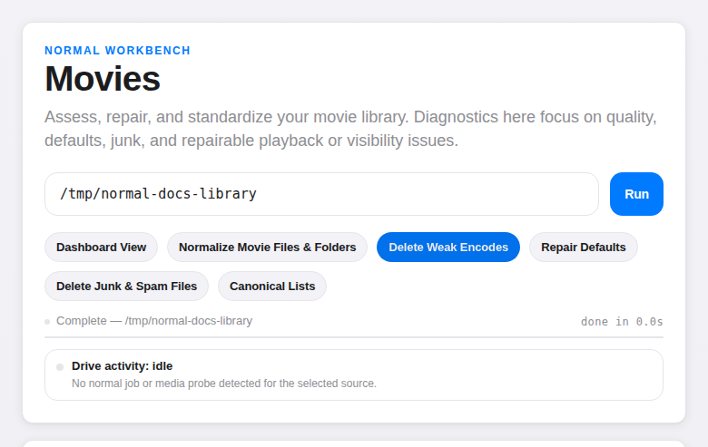
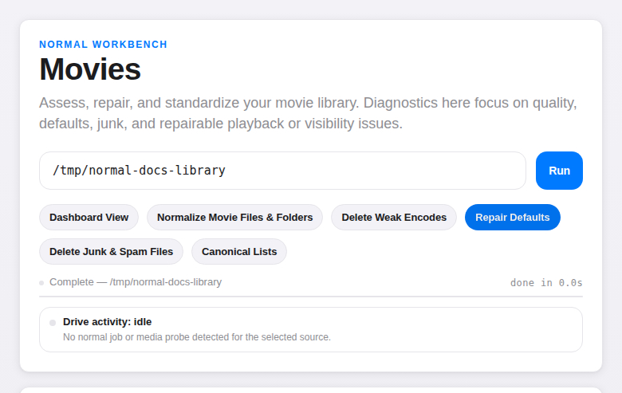
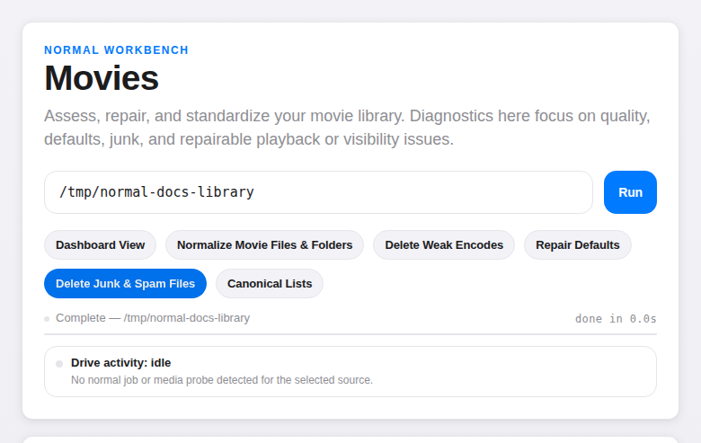

# Movies

*Authorship: Agent-written.*

The movie workflow is the product now. It is not a generic media organizer. It is a deliberate local system for forcing a pirate movie library toward a cleaner downstream shape with as little ambiguity, scan waste, and junk tolerance as possible.



## Dashboard

A library-wide view of encode quality, resolution mix, standards posture, and replacement pressure. This is the first stop if you want to understand what kind of library you actually have rather than what you imagine you have.

To export a formatted XLSX catalogue of the current library, use the **Export** button on the Movies library card in the Library Switcher.

## Canonical Lists

The **Canonical Lists** page compares owned titles against live all-time movie lists using TMDb and a local cache. It is title-coverage focused. Bitrate, quality tiers, and warning telemetry do not affect the result.

Pass `--tmdb-key` to `normal web` or set `TMDB_KEY` before launch. Current badges are intentionally simple and good enough for first-pass coverage tracking; badge-system refinement is deferred.
For the broader local-first versus outbound API posture, see [Safety](safety.md#networking-behaviour).



## Normalize names

Uploader naming is usually sloppy. `normal` parses each path locally with no remote metadata and proposes a clean target shape:

```
Title (Year)/Title (Year).mkv
```

The production normalizer is concise-first and treated as the intended movie shape. **All Results** includes already-normalized items as no-change rows so the preview shows the full downstream structure, not just the diffs.

The internal testing surface at `/parser-tester-ui` is now useful for real downstream inspection rather than just row debugging. It renders the projected library shape inline as a compact directory tree, supports staged preview through row selection, and can confirm the same normalize apply action the main UI uses. That makes it useful both for checking whether a proposal is merely parsable and for checking whether the selected downstream shape is coherent before applying it.

Verbose naming still exists temporarily in the CLI as parser-hardening scaffolding, but it is not the public end state:

```
Title (Year) [technical tokens]/Title (Year) [technical tokens].mkv
```

Ambiguous parses and unsafe target collisions are flagged as `review`. Everything else is `safe`. You review the plan before anything moves.

That review boundary now also covers composed target collisions: if a file rename plus folder rename would land on the same final movie path as another proposal, the planner downgrades the case to `review` instead of letting two `safe` actions converge silently on one downstream file.

Concise duplicate handling is subtractive but not lossy when two local copies would otherwise collide. If the scan can distinguish them from parsed path or folder-context tokens, it adds the shortest useful suffix to both folder and file stem, such as `Title (Year) 1080p` and `Title (Year) 2160p`. If no local differentiator is available, the collision stays in review rather than inventing `(2)` names.

That same collision path also covers stale post-split residue. If an older partial cleanup left a concise movie file inside a still-garbled multi-movie package folder, normalize can now strip repeated package-title tail junk from the child path and reuse a concise package-tail token such as `1080p` for both the folder and the file stem instead of carrying the whole package label forward.

Normalize also handles common library-chaos cleanup when the evidence is local and high confidence:

- loose root movie files move into `Title (Year)/Title (Year).ext`, including cases where a sibling `.nfo` provides the title/year
- no-video movie-shaped artifact folders can be renamed, merged into an existing concise folder, deleted when they are duplicate metadata-only remnants, or flagged for review when merge safety is unclear
- metadata-only collection/series/trilogy package artifact folders and root AppleDouble `._*` files can be deleted as safe cleanup proposals
- multi-part movie folders such as CD1/CD2 normalize to one movie folder with part labels preserved in filenames
- multi-movie package folders can be split into individual movie folders when each video file, or a same-stem NFO, locally parses to its own title/year; package marker words such as `trilogy` are not treated as movie titles

The parser stays local and heuristic. It prefers a clear ASCII title segment when a filename includes both non-Latin and English title text before the year, and it can split technical-token runs that appear before a trailing parenthesized year. Tail-token confidence is now weighted by structured evidence rather than simple token length alone, so harmless edition prose no longer sinks otherwise well-supported concise renames while genuinely weak tail evidence can still stay in review. Those parsed tokens still feed collision differentiation and review reasoning, but normalize output stays concise-only.

Current parser hardening is intentionally narrow:

- it reconstructs a small settled punctuation set when local evidence is already present, such as ordinals (`25th`), title abbreviations/initialisms (`Mr.`, `Dr.`, `L.A.`), and the compact `K19` / spaced `K 19` title family into `K-19: ...`
- already-normalized titles that only need one of those deterministic punctuation/display upgrades are treated as `safe` upgrades rather than forced review
- a small explicit canonical-title exception table covers settled edge cases that do not generalize cleanly from local punctuation rules alone, such as `K-Pax`, `TRON: Legacy`, and `WALL-E`
- it keeps the existing punctuation-light stance elsewhere instead of broad apostrophe/colon recovery across arbitrary titles
- it strips stacked tracker or domain credit noise only at the path edges, including `www...`, split-domain forms such as `Oxtorrent Com`, and bracketed domain tags, without trying to clean mid-title words



## Quality triage

A full movie profile scan separates **Action Based** cards from **Quality Profile** cards.

Action cards:

| Card | What it means |
|---|---|
| `deleted, awaiting replacement` | File was deleted through the replacement queue and is still waiting for a better copy |
| `replacement_candidate` | Quality profile is at or below the configured replacement cutoff and is eligible for delete/replace triage |
| `needs_review` | Inline review attention needed, often from subtitle/default/hygiene checks |

Quality profile cards:

| Profile | What it means |
|---|---|
| `Standard Definition` | Weak HD encodes and standard-definition material still worth keeping |
| `Library Grade` | Good enough for casual viewing and broad library selection |
| `Collector Grade` | Solid compact encodes that hold up better on difficult material |
| `Reference` | Mild to no visual compression with lossless-audio posture |

The standards definition lives in repo-local `movie_standards.json`. Dashboard View quality-profile cards own the inline **Edit definition** controls. Replacement Candidate uses a simpler inline **Edit** control: choose the quality-profile cutoff, then save.

Current video-floor presets are intentionally trimmed to plausible movie-library ranges rather than ultra-weak encodes. The 1080p dropdown starts at `4,500 kbps — compact encode` and steps through `5,500 library grade`, `7,500 strong library`, `10,000 collector grade`, `12,500 strong collector`, and `15,000 reference grade` before the higher near-lossless/remux tiers. The 4K dropdown starts at `10,000 kbps — compact encode`, then `15,000 library grade`, `20,000 strong library`, `25,000 reference grade`, followed by the existing `30,000`, `40,000`, and `50,000` upper tiers.

Dashboard movie profile scans stream progress without pre-counting the whole tree. During a scan, the drive activity bar shows processed file count, elapsed time, current `ffprobe` target when visible, and ETA only when a bounded total is known. This avoids false precision on large rebuilds while still showing forward movement.

Persistence posture:

- `movie_standards.json` is the source of truth across server restarts and localhost port changes
- browser cache is only a per-origin dashboard snapshot; `127.0.0.1:8765` and `127.0.0.1:8766` do not share localStorage
- standards saves now use a revision check, so an older tab or stale cached dashboard is rejected instead of silently overwriting a newer standards file
- writes are done with an atomic temp-file replace so interrupted writes do not leave a partial JSON file behind

The audio channel minimum has a companion **Exempt pre-surround era films** setting. Set it to a release-year cutoff (Pre-1970 through Pre-1990) and films released before that year bypass the channel floor check — useful when Library Grade or higher requires 5.1 but classic titles with mono or stereo-only audio have no higher-channel release to replace them with.

Quality scan results include a normalized main-audio summary for the playback-relevant stream alongside audio bitrate — `AAC 2.0`, `Dolby Digital 5.1`, `Dolby Digital Plus 5.1 Atmos`, `Dolby TrueHD 7.1 Atmos`, `DTS-HD MA 5.1`, and similar labels.

In the internal testing shell at `/parser-tester-ui?workflow=weak-encodes`, the
audio bitrate value is clickable. It opens a compact adjacent track inspector
showing each audio stream's language, bitrate, channel layout, and which stream
is marked default. This is primarily there to expose multi-audio packaging
mistakes without bloating the table.

That internal weak-encode shell also exposes a compact `Weak Floor of` control.
Its default is intentionally conservative: `Standard Definition`, not
`Library Grade`. The point of the delete workflow is to identify the weakest
safe replacement candidates first, not to drag stronger library-grade titles
into an aggressive destructive lane by default.

Weak-encode ownership is also narrower than general review ownership. If a file
already contains a good English audio track and the real defect is wrong
default-language packaging, that belongs to `Repair Defaults` rather than
`Delete Weak Encodes`.

The **Delete Weak Encodes** page lets you select weak files for deletion. Each deleted file goes into a replacement queue. When a better encode for the same title shows up in a future scan, it is automatically marked complete.

Queue history has four hard filters: `Deleted, Awaiting Replacement`, `Replaced`, `Deleted From Queue`, and `All Items`. Deleted rows can be dismissed from queue history inline when the release is no longer worth replacing. That action only changes queue state; it does not touch media files.

The queue-history table is sortable by title, year, and IMDb rating. IMDb ratings are fetched server-side from [OMDb](https://www.omdbapi.com/) and require a free API key passed via `--omdb-key` or the `OMDB_KEY` environment variable. Lookups use local title cleanup plus a small cache, so repeated page loads do not keep spending the OMDb quota. Without a key the column is hidden; when OMDb is rate-limited, new cells show `limit` and cached ratings still display.
This is one of the few optional outbound API paths; see [Safety](safety.md#networking-behaviour).



## Repair defaults

`Repair Defaults` is one page with two sub-tabs: `Audio Packaging` and `Subtitle Readiness`.

### Audio Packaging

Some MKVs are muxed with the wrong main audio track: for example, Italian marked as default and a weaker English track left as the fallback. The `Audio Packaging` tab uses the same shared movie profile scan and replacement-queue substrate as weak-encode triage, but with different issue rules:

- detect non-English default audio when English is present
- flag the stronger case where the English fallback is materially weaker than the default track
- show the main audio summary plus default-vs-English stream summaries so the queue is explainable before deletion

For MKVs, the page can do an in-place lossless repair that flips the default audio flag to the best English track. It also supports a stricter variant that drops streams explicitly tagged as non-English while keeping English and untagged audio. Unsupported containers stay review-only.

While a remux is running, the page locks checkbox selection and disables conflicting bulk actions. The destructive **Delete Selected Files** button is separated to the far right of the action row so it is visually distinct from the two repair actions.

Current safety note: **Make English Default** has been exercised against real files. **Make English Default + Delete Foreign Audio** is implemented but currently untested on real libraries and should still be treated cautiously.

### Subtitle Readiness

The `Subtitle Readiness` tab is the sibling repair lane built on the same profile scan. It follows the current subtitle hygiene stance from the standards engine:

- default to no subtitle when main audio is already English
- default to forced English when a forced English subtitle exists
- default to English subtitles when the default audio track is non-English

This workflow is non-destructive: it does not delete media files or subtitle files, and it does not use the replacement queue. For supported MKVs it can do a lossless in-place remux that only updates embedded subtitle default flags. If the needed English or forced-English subtitle does not exist, the item stays review-only.

Current scope is embedded subtitle streams already inside the container. External `.srt` / `.ass` sidecars are not modified.

Subtitle review-only and fixed items are also tracked in subtitle history. That is useful today, but it is not yet a finished broad audit system for every destructive or repair action in the product.



## Junk cleanup

`Delete Junk & Spam Files` is one combined scan with two result panels:

- junk-marker videos such as samples, extras, and featurettes, detected from filenames, ancestor folders, and conservative size thresholds with a hard 4 GB suppression ceiling
- promo PDFs, NFOs, HTML files, and other non-video sidecar spam

Both are preview-first. Nothing is deleted until you select rows and confirm.

Current honesty note: junk deletion history in the UI is useful for the session, but long-term permanence and coherence of junk-deletion audit logging still has a real gap.



## Catalogue export

Export a formatted XLSX of your full library: title, year, resolution, video codec, audio, container, file size — sorted alphabetically.

```bash
normal movie-register --report scan.json --xlsx catalogue.xlsx
```

The `Audio` column uses the same normalized main-audio summary as the scan and web UI.

## Web UI pages

| Page | What it does |
|---|---|
| Dashboard View | Quality overview, replacement pressure, histograms, standards editing |
| Normalize Movie Files & Folders | Review and apply rename plans |
| Delete Weak Encodes | Triage low-floor encodes and queue replacements |
| Repair Defaults | Fix default audio/subtitle behavior where supported, or keep review cases visible |
| Delete Junk & Spam Files | Remove junk videos and sidecar spam after preview and confirmation |
| Canonical Lists | Compare owned titles against curated movie lists and unlock simple coverage badges |

Movie scan cancellation is cooperative rather than instantaneous. Scans check for cancellation between files, while a currently running `ffprobe` may still finish or hit its timeout before unwind completes. The earlier cancelled-scan / stray-`ffprobe` rough edge is no longer treated as an active concern after the current scan-control hardening.

Low priority parsing edge case: some low-quality multi-movie pack names can leak genre-style tokens such as `Sci Fi` into the parsed title when those tokens appear before the year. Current guidance is to treat those as local repair cases rather than broaden the parser heuristics.
