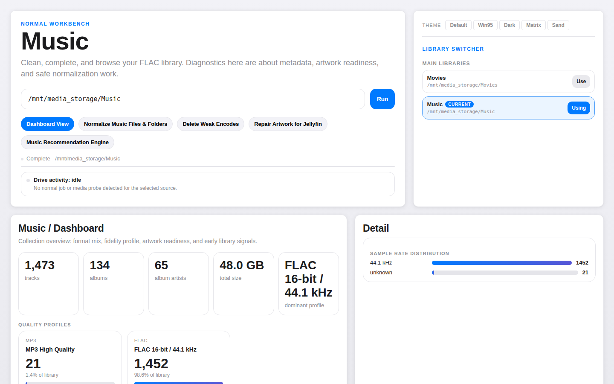

# Music

The music lane normalizes FLAC libraries: tags, filenames, folder structure, and Jellyfin artwork — without touching anything until you explicitly apply.



## Dashboard

A library-wide profile by format and fidelity — FLAC vs lossy, bit depth and sample rate breakdown, artwork readiness per artist. Useful for understanding what's already in good shape and where the rough edges are.

## Normalize

The pipeline is scan → plan → review → apply.

**Scan** reads your FLAC library, groups tracks into albums, and reports tag inconsistencies and naming issues. Nothing is changed.

**Plan** turns scan findings into a concrete list of proposed changes — tag edits, file renames, folder moves — each labelled `safe` or `review`. Safe changes are deterministic. Review changes need a human call.

**Apply** executes the plan. The default writes to a new directory so your source is untouched. In-place is available but has to be explicitly opted in to.

You can run the full pipeline in the web UI with an interactive review step, or via CLI if you'd rather diff the plan file directly.

## Artwork repair for Jellyfin

Libraries built up over time often have missing or inconsistent artist artwork. `normal` scans for artist images, surfaces candidates for approval, and writes them as Jellyfin-compatible sidecars.

Low-confidence writes are tagged with a provenance file so future scans know what was placed by `normal` versus what was already there — and can restore the right label after a rescan.

## CSV export

Export an album-level CSV of your cleaned library: artist, album, year, genre, track count, path.

```bash
normal output --source /path/to/music --csv collection.csv
```

## Web UI pages

| Page | What it does |
|---|---|
| Dashboard | Format mix, fidelity profile, artwork readiness |
| Normalize | Interactive plan review and apply |
| Repair Artwork | Artist browser with candidate preview and approve/write |
